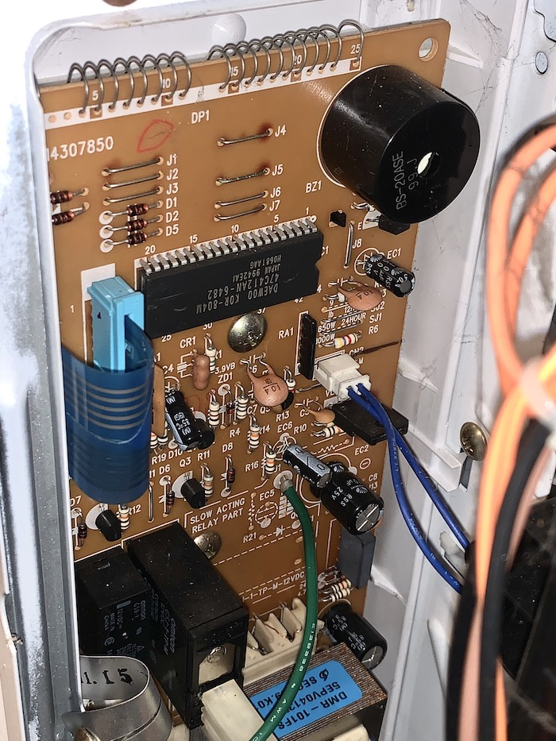

# Pimp My Microwave

[More about duckyPad](https://www.kickstarter.com/projects/dekunukem/duckypad-do-it-all-mechanical-macropad) | [Official Discord](https://discord.gg/4sJCBx5)

-----

Mechanical keyboards are all the rage these days! People love the satisfying tactile sensation, and some go on great lengths to customise them to their exact liking. 

That begs the question: If people love it *that much*, why stop at just *computer* keyboards?

If you think about it, there are *plenty* of everyday input devices in desperate need of mech-ing up!

For example... a `microwave keypad`??

Yep you heard that right!

Here is the story of how I added a [RGB OLED hot-swap mechanical keypad](https://github.com/dekuNukem/duckyPad) to create the most pimped-up microwave in the entire world!

[Click me](https://www.youtube.com/watch?v=BKcvKsYxbbo) for high-res video with sound!

## Background

A year ago, I picked up a used microwave for £5 at a carboot sale. It was a "`Proline Micro Chef ST44`":

It appears to be from early 2000s, and is pretty unremarkable in every way. But it was cheap and it works, so good enough for me!

## Problem!

That is, until almost exactly a year later. I pressed the usual buttons to heat up my meal, but nothing happened.

After the initial disbelief, my thorough investigation by randomly prodding buttons revealed that the membrane keypad is likely broken. At first a few buttons still worked, but soon  all the buttons stopped responding.

At this point I could have just chucked it and still got my money's worth. But it seemed like a waste just because a cheap plastic keypad failed. Plus I could save a few pounds if I fixed it instead of buying a new one.

So I took it apart and see if there was anything I could do.

## Disassembly

After removing the case, we can see the main circuit board:

* Microcontroller at top-middle

* Buzzer at top-right

* Blue ribbon connector for keypad at middle-left

* Transformer and control relays near the bottom

* Entire board is through-hole, but I guess if it works it works!

Here is the front side:

The board is well marked, and it's interesting to see it uses a [Vacuum Fluorescent Display](https://en.wikipedia.org/wiki/Vacuum_fluorescent_display) (VFD), which was already falling out of favour by the time this was made.

I also noticed this board, and in fact everything inside, was designed by [Daewoo](https://en.wikipedia.org/wiki/Daewoo), a **Korean** conglomerate making everything from cars to, well, this.

Anyway, back to the matter at hand. I thought I could just clean up the ribbon cable contacts and call it a day. Except I didn't notice the contacts were made from carbon(graphite?) instead of the usual metal, and I rubbed some right off:

So if it wasn't broken then, it's definitely broken now. Great job!

## Enter the Matrix (Scanning)

Still, it wasn't the end of the world. The keypad almost certainly uses **`Matrix Scanning`** to interface with the controller.

There is a [detailed introduction of this topic](https://learn.sparkfun.com/tutorials/button-pad-hookup-guide/all) on Sparkfun. But in short, matrix scanning allows us to **read a large number of inputs from limited number of controller pins**. 

For example, there are *more than 100 keys* on our computer keyboard. If we simply connect each key to an input pin, the controller chip will need to have more than 100 pins! It will be bulky, difficult to route, and expensive to produce.

Instead, with a little cleverness in the firmware, we can arrange the buttons in a **grid of columns and rows**, AKA a matrix, like this:

This way, by **scanning a single row and column at a time**, we can determine which key(s) are pressed. Of course there are a lot more technicalities, so [read more here](http://blog.komar.be/how-to-make-a-keyboard-the-matrix/) if you want.

Anyway, in the example above, instead of `4 * 4 = 16` pins, we only need `4 + 4 = 8` pins, a saving of half! And with our computer keyboard, we will only need [around 20 pins](resources/pics/logi.png) instead of more than 100!

Thus, we can see that Matrix Scanning simplifies the pin count and design complexity of input devices.

## Figuring Out the Matrix

Back to our microwave keypad at hand. We can see its ribbon cable comes in two parts, each with 5 pins:

So if my assumptions are correct, it would be a 5x5 matrix with 25 buttons. If you scroll all the way back up, you'll find the keypad has 24 buttons, so it checks out!

Now we know there are 5 columns and 5 rows, it's time to figure out which key is which.

To do that, I desoldered the ribbon cable connector and replaced it with a straight male header:

As a side note, the microcontroller is a [TMP47C412AN](resources/TMP47C412AN.pdf) designed by Toshiba. It is a *4-bit* processor with 4KB of ROM and 128 *Bytes* of RAM. It can also directly drive Vacuum Fluorescent Tubes. So all in all, a very specialised chip for appliances. Very underpowered compared to Arduinos and STM32s. But still, it gets the job done!

I connected some jumper wires:

And labeled the rows and columns with 1-5 and A-E:

I then put the board back, powered on, and touched each pair of wires to see which button it responds as.

It took a while, but eventually I figured out the matrix location of the buttons I need:

|   | A     | B    | C     | D | E     |
|---|-------|------|-------|---|-------|
| 1 | NP_4  | NP_1 |       |   |       |
| 2 | NP_5  | NP_2 |       |   | NP_7  |
| 3 | NP_6  | NP_3 | POWER |   | NP_8  |
| 4 | STOP  |      | TIME  |   | NP_9  |
| 5 | START |      |       |   | NP_10 |

So all in all, 10 numpad keys and 4 control buttons. There are a bunch of other buttons, but I didn't bother since I don't use them anyway.

I quickly whipped up a simple schematic:

With that, I hard-wired some buttons on a perf board as a quick and dirty fix:

It works! At least I'll have hot meals now! And it didn't cost me a dime.

But as you can see, it is very messy with 10 wires coming out of the case, and I'm sure I could do better.

## Pimp It Up!

Around the same time, I was working on [duckyPad](https://github.com/dekuNukem/duckyPad), a 15-key mechanical macropad with **OLED**, **hot-swap**, **RGB**, and sophisticated input automation with [duckyScript](https://github.com/dekuNukem/duckyPad/blob/master/duckyscript_info.md):

[Feel free to check out the project page](https://github.com/dekuNukem/duckyPad) if you're interested!

It was called a `"Do-It-All Macropad"`, so to live up to its name, it was only natural that I get it working on my microwave too!

And if I pull this off, my lowly 20-year-old second-hand broken microwave will transform into the *only one in the entire world* with mechanical switches and RGB lighting! Now that's what I call ... a Korean Custom 😅.

However, it wasn't as easy as it sounds. There are a number of challenges:

* I want to use the existing duckyPad as-is, so no redesigning.

* I want to keep it clean and tidy, so the fewer wires the better.

* It has to be powered by the microwave itself too.

## PMM Board

Right now, there are 10 wires coming out of the case and into my hand-made keypad, very messy.

Ideally, with duckyPad, I want it to use only need 3 wires: `Power`, `Ground`, and `Data`. With so few wires, they can be inside a single cable, which would be much more clean and tidy.

However, the microwave controller still expects 10 wires from the keypad matrix. So that means I would need an adapter of some sort. Let's just call it PMM board.

duckyPad would talk to PMM board, which in turn talks to the microwave controller. Something like this:

Not too bad! However, until now we have been using **real switches** with the keypad matrix. But with PMM board, we will need to **control the key matrix electronically** to fool the microwave into thinking we pressed buttons! How do we do it?

## Blast From the Past

It came as a bit of a surprise, but after some digging, it turned out that I solved this *exact* problem 3 years ago! Back then, I was trying to automate inputs of [Nintendo Switch Joycons](https://github.com/dekuNukem/joyAnalog), and they also used matrix scanning for their buttons.

And the answer? [`Analogue Switches!`](https://en.wikipedia.org/wiki/Analogue_switch) You can think of them as regular switches, but instead of pushing them with your fingers, they are controlled electronically.

The chip I used is [ADG714](resources/ADG714_715_new.pdf) from Analog Devices. There are 8 switches in one chip, and they are controlled via simple [SPI protocol](resources/spi.pdf):

I quickly designed the PMM board:

It's a relatively simple board. A STM32F042F6P6 is used, and I broke out all of its pins on headers in case I need them.

Since there are 14 buttons that I want to control, two ADG714s are needed. With SPI, they can be daisy-chained easily.

You can see in the schematic that the analogue switches are wired up in exactly the same way as my shoddy hand-soldered keypad. Except now they can be pressed electronically by the microcontroller.

I had the PCB made, and soldered on all the components:

I did a preliminary testing with continuity beeper, and it seemed to work fine, but we'll only know for sure once it is installed on the real thing.

## Serial-ous Talk

Now the PMM board can control the button matrix, how should duckyPad talk to it?

With only 1 wire for data, I reckoned that a simple one-way serial link should be more than enough.

duckyPad would send a simple serial message at 115200bps every time a key is pressed. The PMM board receives it, and if the format is correct, it would momentarily close the corresponding analog switch, simulating a button press to the microwave.

I added a top-secret [`UARTPRINT`](https://github.com/dekuNukem/duckyPad/blob/d50d58d3c9f0525f0a07fb0c0667dcfdf63f0721/firmware/code/Src/parser.c#L1086) command to the duckyScript parser, and [created a profile](https://github.com/dekuNukem/duckyPad/blob/master/getting_started.md) for my microwave keypad.

They keys on duckyPad is arranged as follows:

## Why So Negative?

It's all coming together! Which brings us to the final question: How are we going to power it?

I thought it would be straightforward. There is already a microcontroller on the microwave circuit board, so just tap its power and job done! Turns out, almost but not quite.

Examining the circuit board in detail, it turns out the whole thing runs on *negative voltages*.

We can see it gets -26V from the transformer, steps it down to -12V, then again to -5V. The voltage regulator is a `S7905PIC` fixed-negative-voltage regulator, further confirming this theory.

I'm not sure why it is designed this way, probably has something to do with the AC transformer. Still, it doesn't actually matter that much, as it's just from a different point of reference.

I tapped two power wires from the circuit board to power the PMM board, and in turn, duckyPad:

To reduce confusion, I marked them `0V` and `-5V`.

Usually, we would connect `0V` to GND, and a positive voltage to VCC. But in this case, `0V` is actually at the higher potential. So all I needed to do is connect `-5V` to GND, and `0V` to VCC. The potential difference is still 5V, so everything works.

(Eagle eyed viewers might notice I also covered the buzzer with a sticker. It was so loud!)

## A Duckin' Great Time!

I reinstalled the circuit board, hooked everything up and did a quick test, it works!

You can see the 3 wires going from duckyPad debug header to PMM board, as well as the 10 wires going into the control board where the blue ribbon cable used to be.

I attached the duckyPad to the microwave, chopped off the ends of a cheap USB cable, and used the 4 wires inside to connect everything up through a vent at the bottom.

Voilà! It's done! The first and (probably) only microwave in the entire universe with mechanical switches, OLED, and RGB lighting!

Have you ever experienced the crisp and clicky tactile and audible perfection of Gateron Green switches while heating up some frozen junk food because you're too lazy to cook? Well, *I* have, so there's that!

## I want one too!

If you're interested in a duckyPad, you can [learn more about it and  get one here](https://www.kickstarter.com/projects/dekunukem/duckypad-do-it-all-mechanical-macropad)😅!

And if you want the whole package, unfortunately it would be much more involved.

Each microwave have different keypad layouts, so you'll need to figure them out, and design and build a PMM board yourself. Not a small feat, but at least all the information is here! If you do go down this path, let me know if you have any questions!

Of course there are high voltages and potential of microwave radiation when you take it apart, so be careful!

## Questions or Comments?

Please feel free to [open an issue](https://github.com/dekuNukem/duckypad/issues), ask in the [official duckyPad discord](https://discord.gg/4sJCBx5), DM me on discord `dekuNukem#6998`, or email `dekuNukem`@`gmail`.`com` for inquires.

